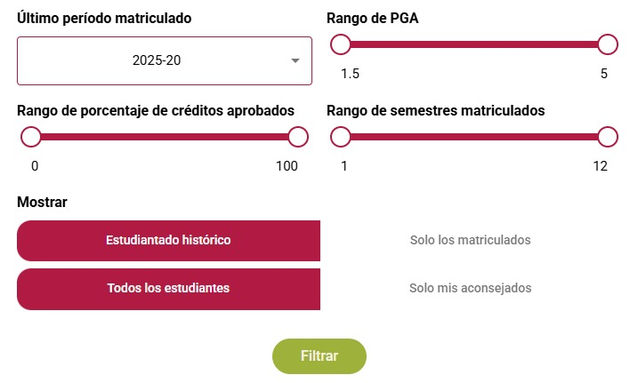

# Identificación de estudiantes



### Acceda a No estás Solx:


Ingrese al enlace haciendo Clic Derecho>Abrir enlace en una pestaña nueva


Utilice el reporte de **Mis aconsejados,** y abra el panel de filtros:

<figure><figcaption></figcaption></figure>

Seleccione para el filtro de **Nivel académico** la opción de **Pregrado**, y para el filtro de **Programa** seleccione la **Facultad de Ingeniería** y luego su programa:

<figure><figcaption></figcaption></figure>

Finalmente para el filtro **Último período matriculado** seleccione **2025-20** y active la opción de **Estudiantado histórico** y **Todos los estudiantes:**

<figure><figcaption></figcaption></figure>

Cuando aplique los filtros, podrá ver un número indicativo del número de estudiantes que satisfacen los criterios, y podrá visualizar los resultados en modo de **tarjetas** o en una **tabla** usando el botón en la parte superior de los resultados:

<figure><figcaption></figcaption></figure>

Una de las ventajas de la visualización en formato de tabla es que puede seleccionar qué columnas mostrar usando el botón en la parte superior del listado:

<figure><figcaption></figcaption></figure>

Puede elegir en el menú desplegable diferentes columnas que serán mostradas en la interfaz:

<figure><figcaption></figcaption></figure>

Finalmente puede descargarse el resultado en un archivo con el botón de descargas en la parte superior del listado:

<figure><figcaption></figcaption></figure>



### ¿Quiénes son los estudiantes de su programa que están en prueba académica en el semestre actual?

Para identificar a estos estudiantes, utilice el filtro de **Estado Académico** y seleccione la opción **Prueba Académica:**

<figure><figcaption></figcaption></figure>

Revise los perfiles de los estudiantes



### ¿Quiénes son los estudiantes de su programa que han aprobado menos del 50% de los créditos vistos?

Para identificar a estos estudiantes, utilice el filtro de **Riesgo académico** y seleccione la opción **Materia Bloqueante:**

<figure><figcaption></figcaption></figure>




### ¿Quiénes son los estudiantes de su programa con alguna materia bloqueante?

Para identificar a estos estudiantes, utilice la barra de desplazamiento de **Rango de porcentaje de créditos aprobados** y asegúrese que el intervalo activo esté entre **0** y **50:**

<figure><figcaption></figcaption></figure>



### ¿Quiénes son los estudiantes de su programa con PGA bajo?

Para identificar a estos estudiantes, utilice el filtro de **Riesgo académico** y seleccione la opción **PGA bajo en tercer semestre o más:**

<figure><figcaption></figcaption></figure>



### ¿Quiénes son los estudiantes con estado académico normal qué han perdido dos o más semestres completos?

Para identificar a estos estudiantes, utilice el filtro de **Riesgo académico** y seleccione la opción **Semestres perdidos:**

<figure><figcaption></figcaption></figure>



### Registre conclusiones y descubrimientos al analizar a los estudiantes en en el padlet


Ingrese al enlace haciendo Clic Derecho>Abrir enlace en una pestaña nueva




