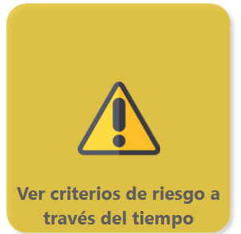

# Tendencias globales



#### Acceda al reporte de PowerBI del observatorio académico


Ingrese al enlace haciendo Clic Derecho>Abrir enlace en una pestaña nueva


Acceda al reporte de **Ver criterios de riesgo a través del tiempo** (puede acceder también a través de la pestaña C**riterios de riesgo todo pregrado**)

<figure><figcaption></figcaption></figure>

Responda a las preguntas de los siguientes pasos usando los reportes correspondientes.



#### Revisando el semestre 2025-10 ¿Qué porcentaje de los estudiantes de su programa han estado en prueba académica en los últimos cuatro semestres?

Utilice el filtro de **Programa.** Desactive los otros filtros y active únicamente el filtro de **¿Ha estado en prueba académica los últimos 4 semestres?**

<figure><figcaption></figcaption></figure>



#### Revisando los últimos 7 años ¿Cuál es la tendencia de la población de estudiantes en su programa que han estado en prueba académica en los últimos cuatro semestres?

Utilice el filtro de **Programa.** Desactive los otros filtros y active únicamente el filtro de **¿Ha estado en prueba académica los últimos 4 semestres?**

<figure><figcaption></figcaption></figure>



#### Revisando el semestre 2025-10 ¿Qué porcentaje de los estudiantes de su programa han aprobado menos del 50% de los créditos?

Utilice el filtro de **Programa.** Desactive los otros filtros y active únicamente el filtro de **¿Ha aprobado menos del 50% de sus créditos?**

<figure><figcaption></figcaption></figure>



#### Revisando los últimos 7 años ¿Cuál es la tendencia de la población de estudiantes en su programa que han aprobado menos del 50% de los créditos?

Utilice el filtro de **Programa.** Desactive los otros filtros y active únicamente el filtro de **¿Ha aprobado menos del 50% de sus créditos?**

<figure><figcaption></figcaption></figure>



#### Revisando el semestre 2025-10 ¿Qué porcentaje de los estudiantes de su programa han visto una materia 3 veces o más?

Utilice el filtro de **Programa.** Desactive los otros filtros y active únicamente el filtro de **¿Una materia vista 3 veces o más?**

<figure><figcaption></figcaption></figure>



#### Revisando los últimos 7 años ¿Cómo es el comportamiento de la población de estudiantes en su programa que han visto una materia 3 veces o más en los últimos 7 años?

Utilice el filtro de **Programa.** Desactive los otros filtros y active únicamente el filtro de **¿Una materia vista 3 veces o más?**

<figure><figcaption></figcaption></figure>



#### Registre las respuestas a sus preguntas en el padlet


Ingrese al enlace haciendo Clic Derecho>Abrir enlace en una pestaña nueva



