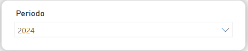

# Desempeño global



### Acceda al reporte de PowerBI del estudio de SaberPro


Ingrese al enlace haciendo Clic Derecho>Abrir enlace en una pestaña nueva


Responda a las preguntas de los siguientes pasos usando los reportes corespondientes.



### ¿Cómo es el comportamiento del puntaje global de las top 3 universidades en los últimos 7 años?

Acceda al reporte de **Top N instituciones**:

<figure><figcaption></figcaption></figure>

Como las top 3 universidades varían en el tiempo, es necesario seleccionar un año de presentación de la prueba. Para esto utilice el filtro de **Periodo**:

<figure><figcaption></figcaption></figure>

Para seleccionar las top 3 universidades de dicho año, utilice el filtro de **Top universidades**:

<figure><figcaption></figcaption></figure>

La gráfica **Puntaje promedio por institución** se actualizará para mostrar el comportamiento de estas universidades a lo largo del tiempo.



### ¿Cómo es el comportamiento del puntaje global de las top 3 universidades en las pruebas genéricas con relación al de Uniandes durante los últimos 7 años? ¿Cómo se compara con el de otras universidades que usted considera son competencia?

Acceda al reporte de **Puntaje global por institución**:

<figure><figcaption></figcaption></figure>

En esta ocasión el filtro de **Top universidades** representa las universidades que en promedio han obtenido el mejor puntaje en los últimos 7 años. Utilice el filtro para poder visualizarlas en el reporte:

<figure><figcaption></figcaption></figure>

Para añadir manualmente otras universidades, utilice el filtro de **Institución**. Puede utilizar elcampo de "Search" para localizar rápidamente el nombre de la universidad de interés:

<figure><figcaption></figcaption></figure>



### Registre las respuestas a sus preguntas en el padlet


Ingrese al enlace haciendo Clic Derecho>Abrir enlace en una pestaña nueva




